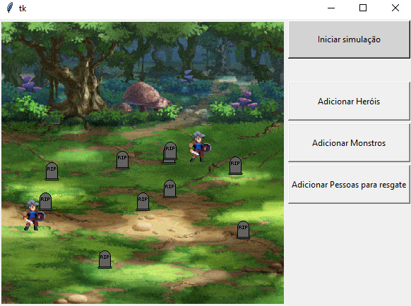

# The scape

**Disciplina**: FGA0210 - PARADIGMAS DE PROGRAMAÇÃO - T02 <br>
**Nro do Grupo (de acordo com a Planilha de Divisão dos Grupos)**: 01<br>
**Paradigma**: Sistemas Multiagentes<br>

## Alunos
|Matrícula | Aluno |
| -- | -- |
| 19/0054832 | Arthur Talles de Sousa Cunha       |
| 18/0105256 | Lucas da Cunha Andrade             |
| 18/0066382 | Marcos Felipe de Almeida Souza     |
| 18/0129147 | Pedro de Miranda Haick             |
| 17/0114929 | Thiago França Vale Oliveira        |
| 18/0068229 | Victor Yukio Cavalcanti Miki       |

## Sobre 
O projeto é voltado para a prática da programação de multiagentes. O tema consiste em uma simulação na qual três agentes, herói, civil e monstro, serão introduzidos em um cenário e o destino de cada um deles será proporcional à sua quantidade, definida pelo usuário.
Os três agentes possuem autonomia entre si. Contudo, a co-existência deles gera problemas, tendo em vista que possuem objetivos conflitantes.

## Screenshots



 
## Instalação

Linguagens : Python
Tecnologias : mesa, tkinker, Turtle, Pygame

Após clonar o repositório, instale o requerimentos com o seguinte comando no terminal:

```sh
pip install -r requirements.txt
```

## Uso 
O passo a passo para rodar o projeto é:

1. No diretório do projeto digite comando "python server.py" no terminal e espere a interface carregar por completa ( quando os botões aparecerem).
2. Aperte o botão "Iniciar Simulação" e divirta-se com a simulação da batalha.
3. Caso deseje adicionar um agente, existe um botão específico para cada um deles.

## Vídeo
A apresentação pode ser encontrada neste [link](https://youtu.be/9teherrviqc)

## Participações
Apresente, brevemente, como cada membro do grupo contribuiu para o projeto.
|Nome do Membro | Contribuição | Significância da Contribuição para o Projeto (Excelente/Boa/Regular/Ruim/Nula) |
| -- | -- | -- |
| Arthur Talles de Sousa Cunha |  Contribuição para implementação gráfica, para a lógica dos agentes, bem como os comportamentos esperados. | Excelente |
| Marcos Felipe de Almeida Souza |  Contribuição para implementação gráfica, para a lógica dos agentes, bem como os comportamentos esperados, além dos efeitos especiais que trouxeram mais interatividade entre os agentes. | Excelente |

### Commits
   Um gráfico de commits pode ser visualizado neste [link](https://github.com/UnBParadigmas2023-1-Turma02/2023.1_G1_SMA_La_Savannah/pulse)
## Outros 
### Lições Aprendidas
|Nome do Membro | Lições Aprendidas | 
| -------- | -- | 
| Arthur Talles  |  Com a realização do projeto, pude ampliar meus conhecimentos e brincar com a parte gráfica do Python. Além disso, atrelar isso a um projeto que envolve simulações foi bastante interessante. Penso que isto foi apenas um "átomo " perto de tudo aquilo que pode ser explorado fazendo uso de sistemas multiagentes.   

### Percepções;
|Nome do Membro | Percepções | 
| -- | -- | 
| Arthur Talles  |  Posso estar enganado, contudo utilizar o mesa como framework e aliá-lo à outras ferramentas gráficas muitas vezes me fez sentir disperso em relação ao paradigma. Talvez isso se deva por não ser algo tão convencional, tendo como base os demais repositórios. No entanto, a lógica de agentes co-existindo, com autonomia e objetivos bem delimitados, nos deu esperança de estarmos trilhando um caminho diferente, porém em conformidade com o paradigma.  |  


### Fragilidades
|Nome do Membro | Fragilidades | 
| -- | -- | 
| Arthur Talles  | A interface poderia ser maior para se ter uma melhor movimentação dos agentes. Além dos agentes possuírem comportamentos que poderiam ser melhor explorados. |  


### Trabalhos Futuros.
|Nome do Membro | Ideias para trabalhos futuros | 
| -- | -- | 
| Arthur Talles  | Os monstros poderiam oferecer mais dano ao herói a ponto de que a vida dele pudesse ser decrementada até, eventualmente, chegar em zero. Além disso, alguns comportamentos especiais de batalha poderiam ser futuramente implementados. Contudo, acredito que esta ideia pode ser reaproveitada para vários outros temas que envolvam contextos de ação e aventura.|  


## Fontes
* tkinker: <https://docs.python.org/3/library/tkinter.html>
* mesa: <https://mesa.readthedocs.io/en/latest/tutorials/intro_tutorial.html>
* Turtle: <https://docs.python.org/3/library/turtle.html>
* Pygame: <https://www.pygame.org/news>


