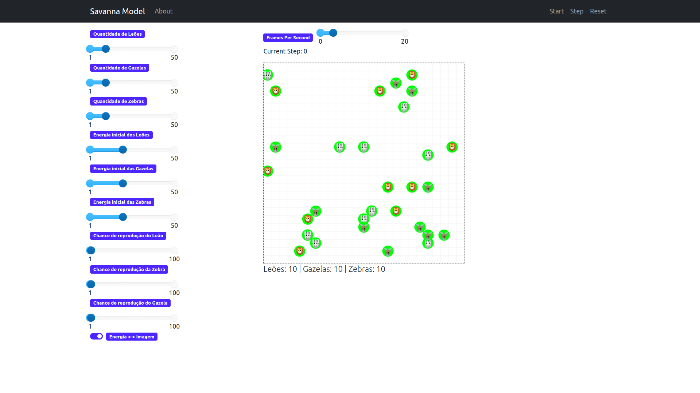

# 2023.1 G1 SMA: La Savannah

**Disciplina**: FGA0210 - PARADIGMAS DE PROGRAMAÇÃO - T03  
**Nro do Grupo (de acordo com a Planilha de Divisão dos Grupos)**: 01 
**Paradigma**: Funcional 

## Alunos
| Matrícula  | Aluno                          |
| ---------- | ------------------------------ |
| 19/0054832 | Arthur Talles de Sousa Cunha   |
| 18/0105256 | Lucas da Cunha Andrade         |
| 18/0066382 | Marcos Felipe de Almeida Souza |
| 18/0129147 | Pedro de Miranda Haick         |
| 17/0114929 | Thiago França Vale Oliveira    |
| 18/0068229 | Victor Yukio Cavalcanti Miki   |

## Sobre 
Esse projeto é uma simulação de uma savana cujo os animais interagem entre si para descobrir que é o rei da La Savannah. Utilizamos o Mesa que é uma biblioteca de código aberto em Python para modelagem, simulação e análise de agentes baseados em modelos (ABMs - Agent-Based Models). ABMs são uma abordagem de modelagem na qual entidades individuais (agentes) interagem em um ambiente para observar o comportamento coletivo do sistema.

Os animais são os agentes que interagem com o ambiente (Savana) e outros animais. Eles se movem aleatóriamente pelo mapa ao custo de energia e quando se deparam com uma presa adjacente ao seu quadrado ele a devora, recuperando a energia gasta e eliminando o animal.

O programa acaba que restar apenas um único tipo de animal.

Tela da simulação

## Screenshots

Agora que conhecemos o projeto tem algumas screenshots.

Figura 1: Tela inicial da simulação.

Figura 2: Energia dos animais da simulação.

Figura 3: Fim de simulação.

## Instalação 
**Linguagens**: Python 
**Tecnologias**: MESA 
Pré-requisitos para rodar o seu projeto e os comandos necessários:

Instalar o [python 3 ou superior](https://www.python.org/downloads/). Python é uma linguagem de programação legível e versátil, usada em desenvolvimento web, análise de dados e automação.

* No Windowns, macOS e Linux:

Após instalação e configuração do ambiente de desenvolvimento clonamos o reposítório com o comando:

> $ git clone https://github.com/UnBParadigmas2023-1-Turma02/2023.1_G1_SMA_La_Savannah.git

## Uso 

Para rodar o projeto é recomendado criar um ambiente virtual para melhor experiência. Para isso utilizamos o venv.

na raíz do diretória rodamos:

| $ python3 -m venv project_env

e ativamos o ambiente virtual com:

| $ source project_env/bin/activate ou activate.bat para windowns

Dentro do ambiente virtual instalar as dependências com:

| $ pip install requirements.txt

Por fim, rodar o programa com:

| $ python main.py

Com o projeto rodando, basta definir os valores iniciais de cada animal e iniciar a simulação pressionando o botão start, também é possível andar passo a passo para acompanhar bem as interações. Para começar uma nova simulação basta pressionar o botão reset, lembrando que ao alterar qualquer valor, também é necessário pressionar esse botão para que os valores sejam alterados. 
## Vídeo
Segue a seguir o link do video:

[Link do video]().

## Participações
Participação dos membros do grupo para o projeto:
| Nome do Membro               | Contribuição                                                                       | Significância da Contribuição para o Projeto (Excelente/Boa/Regular/Ruim/Nula) |
| ---------------------------- | ---------------------------------------------------------------------------------- | ------------------------------------------------------------------------------ |
| Lucas da Cunha Andrade       | configuração do ambiente, renderizar server da página, metodos das classes agentes | Excelente                                                                      |
| Pedro de Miranda Haick       | modelagem dos agentes                                                              | Boa                                                                            |
| Thiago França Vale Oliveira  | Criação das portrayts, suas funções e seus modos alternativos, aperfeiçoamento da interface e correção de bugs                                 | Boa                     
| Victor Yukio Cavalcanti Miki | Idealização do projeto, renderizar imagens, docker                                 | Boa                                                                            |

## Outros 

### Lições Aprendidas
|Nome do Membro | Lições Aprendidas | 
| -------- | -- | 
| Lucas da Cunha  | Optamos por escolher a biblioteca MESA em python para trabalhar e apesar de ser de fácil uso, entregando as classes e métodos de forma bem mastigada, tivemos dificuldades em personaliza-las. |   

### Percepções;
|Nome do Membro | Percepções | 
| -- | -- | 
| Victor yukio  |  Uma perceção que tivemos foi na interação conjunta de três animais predando um ao outro como em um jogo de pedra, papel e tesoura. a forma que os agentes multithread lidam com o código fez com que os três animais dentro da interação fossem devorados.  |  

### Fragilidades
|Nome do Membro | Fragilidades | 
| -- | -- | 
| Thiago  |  |  

### Trabalhos Futuros.
|Nome do Membro | Ideias para trabalhos futuros | 
| -- | -- | 
| Victor  | Poderia ter mais animais e métodos mais desenvolvidos. A parte de procriar dos animais, por exemplo, poderia usar a fome atual do personagem e a necessidade de encontrar outro membro da mesma espécie. Ou a criação de uma Classe VEGETACAO para usar  como base da cadeia alimentar. Até o momento configurar um cadeia alimentar equilibrada e lógica foi uma tarefa que não priorizamos. |  

## Fontes
https://mesa.readthedocs.io/en/stable/#
https://docs.python.org/3/

# Aviso  

 

O segundo projeto elaborado pode ser encontrado nesta [branch](https://github.com/UnBParadigmas2023-1-Turma02/2023.1_G1_SMA_La_Savannah/tree/projeto_monster_escape)

